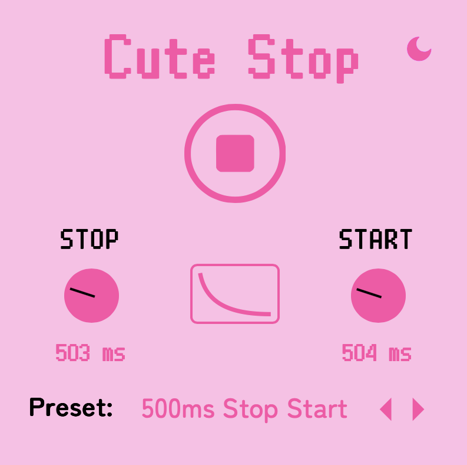

# Cute Stop

Cute Stop is a VST plugin for tape stop effects.

### Controls:
- Stop/Start Button - Stop or start the effect
- Stop Time - the stop time in ms
- Start Time - the start time in ms
- Curve - Choose from exponential, linear, or logarithmic curves

This should work well with DAW playback since it resets whenever you rewind the playhead. Most 
plugins that I used seem to keep the effect active, causing silent audio. 

### Design

Our design is available here: https://www.figma.com/design/jOlYQw7VuwKc2q57O1ALn6/Cute-Stop

### Purchase

### See Also

- [Cute Pitch](https://github.com/Moebytes/Cute-Pitch) 
- [Cute Crush](https://github.com/Moebytes/Cute-Crush)
- [Cute Filter](https://github.com/Moebytes/Cute-Filter)